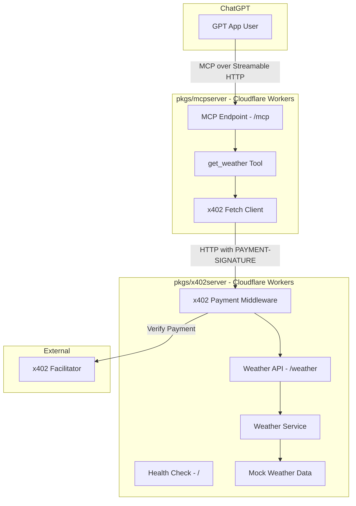
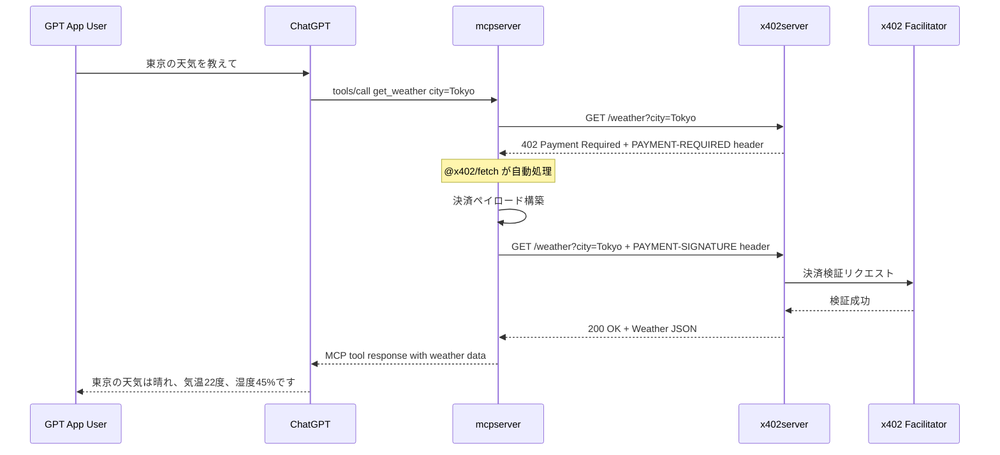
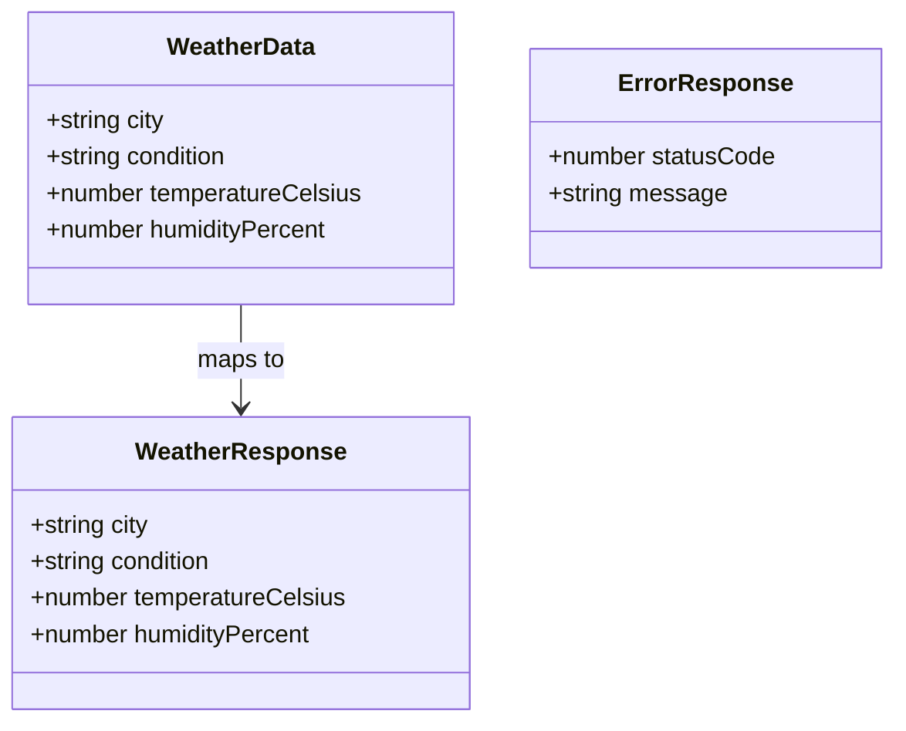

# Design Document: x402-weather-payment

## Overview

**Purpose**: x402プロトコルによるステーブルコイン決済付き天気予報APIと、GPT App（ChatGPT）からアクセスするためのMCPサーバーを提供する。

**Users**: GPT Appユーザーがチャットインターフェースから天気予報を問い合わせる。開発者がx402プロトコル統合のリファレンス実装として参照する。

**Impact**: 既存のHono hello-worldスキャフォールド（`pkgs/x402server/`、`pkgs/mcpserver/`）を天気予報API + x402決済、MCPサーバーとして実装する。

### Goals
- x402プロトコルの決済フローを天気予報APIで実演する
- MCPサーバーを通じてGPT Appから天気予報 + 決済を透過的に実行する
- サンプルアプリとして理解しやすく、拡張可能な設計にする

### Non-Goals
- 本番環境向けの堅牢な認証・認可システム
- リアルタイム天気データの取得（初期実装はモックデータ）
- UIコンポーネント（MCPサーバーはツールのみ提供、UIなし）
- 複数通貨・複数ネットワークのサポート（Base Sepoliaテストネットのみ）

## Architecture

### Architecture Pattern & Boundary Map



**Architecture Integration**:
- **Selected pattern**: レイヤードアーキテクチャ。天気データソースのみアダプターパターンで抽象化（詳細は`research.md`参照）
- **Domain boundaries**: x402serverは天気API + 決済を担当、mcpserverはMCPプロトコル + x402クライアントを担当
- **Existing patterns**: Hono + Cloudflare Workers構成、pnpm monorepo構造を維持
- **Steering compliance**: kebab-caseファイル名、環境変数によるシークレット管理、ビジネスロジックとルーティングの分離

### Technology Stack

| Layer | Choice / Version | Role in Feature | Notes |
|-------|------------------|-----------------|-------|
| Backend Framework | Hono ^4.12.1 | 両サーバーのHTTPルーティング | 既存依存 |
| x402 Server | @x402/hono, @x402/core, @x402/evm | 決済ミドルウェア | 新規追加 |
| x402 Client | @x402/fetch, @x402/core, @x402/evm | 決済付きHTTPリクエスト | 新規追加 |
| MCP SDK | @modelcontextprotocol/sdk | MCPサーバーコア | 新規追加 |
| MCP Transport | @hono/mcp | Hono用Streamable HTTP Transport | 新規追加 |
| Wallet | viem | EVM秘密鍵からアカウント導出 | @x402/evmの依存 |
| Schema Validation | zod | MCP tool入力スキーマ定義 | 新規追加 |
| Testing | vitest | ユニットテスト | 新規追加 |
| Infrastructure | Cloudflare Workers + Wrangler | エッジデプロイ | 既存設定 |

## System Flows

### 天気予報取得 + x402決済フロー



**Key Decisions**: `@x402/fetch`の`wrapFetchWithPayment`が402レスポンスの検出と決済ペイロード構築を自動化するため、mcpserver側の実装は通常のfetch呼び出しに近い形になる。

## Requirements Traceability

| Requirement | Summary | Components | Interfaces | Flows |
|-------------|---------|------------|------------|-------|
| 1.1 | 都市名指定で天気データJSON返却 | WeatherService, WeatherAPI | GET /weather API | 天気取得フロー |
| 1.2 | 都市名未指定で400返却 | WeatherAPI | GET /weather API | - |
| 1.3 | 都市名不明で404返却 | WeatherService, WeatherAPI | GET /weather API | - |
| 1.4 | レスポンスに都市名・天気・気温・湿度 | WeatherResponse型 | GET /weather API | - |
| 2.1 | 決済なしで402返却 | PaymentMiddleware | PAYMENT-REQUIRED header | 決済フロー |
| 2.2 | 有効決済で天気データ返却 | PaymentMiddleware | PAYMENT-SIGNATURE header | 決済フロー |
| 2.3 | 決済検証失敗で402返却 | PaymentMiddleware | Error response | 決済フロー |
| 2.4 | x402ライブラリ使用 | PaymentMiddleware | @x402/hono | - |
| 3.1 | /mcpエンドポイント公開 | MCPEndpoint | POST /mcp | - |
| 3.2 | get_weatherツール定義 | GetWeatherTool | MCP tool schema | - |
| 3.3 | x402決済付きでx402server呼び出し | X402FetchClient | @x402/fetch | 天気取得フロー |
| 3.4 | 402レスポンス自動処理 | X402FetchClient | @x402/fetch | 決済フロー |
| 3.5 | ツール定義にタイトル・説明・スキーマ | GetWeatherTool | MCP tool schema | - |
| 4.1 | データ取得失敗で503返却 | WeatherService | Error response | - |
| 4.2 | x402server接続失敗でMCPエラー | X402FetchClient | MCP error response | - |
| 4.3 | 決済処理エラーでMCPエラー | X402FetchClient | MCP error response | - |
| 4.4 | 一貫したエラー構造 | ErrorResponse型 | statusCode + message | - |
| 5.1-5.5 | 開発環境・テスト・環境変数 | 全コンポーネント | Wrangler, Vitest, .dev.vars | - |
| 6.1-6.4 | デプロイ・ヘルスチェック | 全コンポーネント | wrangler deploy, GET / | - |

## Components and Interfaces

| Component | Domain/Layer | Intent | Req Coverage | Key Dependencies | Contracts |
|-----------|-------------|--------|--------------|-----------------|-----------|
| WeatherAPI | x402server / Routing | 天気予報エンドポイント | 1.1-1.4, 4.1 | WeatherService (P0) | API |
| PaymentMiddleware | x402server / Middleware | x402決済ゲートウェイ | 2.1-2.4 | @x402/hono (P0), Facilitator (P0) | API |
| WeatherService | x402server / Service | 天気データ取得 | 1.1, 1.3, 1.4, 4.1 | MockWeatherData (P1) | Service |
| MCPEndpoint | mcpserver / Routing | MCPプロトコルエンドポイント | 3.1 | @hono/mcp (P0) | API |
| GetWeatherTool | mcpserver / Tool | 天気予報MCPツール | 3.2, 3.3, 3.5 | X402FetchClient (P0) | Service |
| X402FetchClient | mcpserver / Client | x402決済付きHTTPクライアント | 3.3, 3.4, 4.2, 4.3 | @x402/fetch (P0) | Service |

### x402server Domain

#### WeatherService

| Field | Detail |
|-------|--------|
| Intent | 都市名から天気予報データを取得する |
| Requirements | 1.1, 1.3, 1.4, 4.1 |

**Responsibilities & Constraints**
- 都市名をキーに天気データを検索・返却する
- 不明な都市名の場合はnullを返却（404処理はルーティング層で実施）
- 初期実装はモックデータ、WeatherServiceインターフェースにより外部API差し替え可能

**Dependencies**
- External: MockWeatherData — 静的天気データ (P1)

**Contracts**: Service [x]

##### Service Interface
```typescript
interface WeatherData {
  city: string;
  condition: string;
  temperatureCelsius: number;
  humidityPercent: number;
}

interface WeatherService {
  getWeather(city: string): Promise<WeatherData | null>;
}
```
- Preconditions: cityは空でない文字列
- Postconditions: 該当都市のWeatherDataまたはnull
- Invariants: 同一都市名に対して一貫したデータを返却

#### WeatherAPI

| Field | Detail |
|-------|--------|
| Intent | 天気予報HTTPエンドポイントを提供する |
| Requirements | 1.1-1.4, 4.1, 4.4 |

**Responsibilities & Constraints**
- クエリパラメータ`city`のバリデーション
- WeatherServiceの呼び出しと結果のHTTPレスポンスへのマッピング
- エラーレスポンスの一貫した構造化

**Dependencies**
- Inbound: PaymentMiddleware — 決済検証後のリクエスト転送 (P0)
- Outbound: WeatherService — 天気データ取得 (P0)

**Contracts**: API [x]

##### API Contract
| Method | Endpoint | Request | Response | Errors |
|--------|----------|---------|----------|--------|
| GET | /weather?city={city} | Query: city (string, required) | WeatherResponse | 400, 402, 404, 503 |
| GET | / | - | HealthCheckResponse | - |

```typescript
interface WeatherResponse {
  city: string;
  condition: string;
  temperatureCelsius: number;
  humidityPercent: number;
}

interface ErrorResponse {
  statusCode: number;
  message: string;
}

interface HealthCheckResponse {
  status: "ok";
  service: "x402server";
}
```

#### PaymentMiddleware

| Field | Detail |
|-------|--------|
| Intent | x402プロトコルによる決済ゲートウェイをHonoミドルウェアとして提供する |
| Requirements | 2.1-2.4 |

**Responsibilities & Constraints**
- `@x402/hono`の`paymentMiddleware`を天気予報エンドポイントに適用
- ルートごとの価格設定（USD）とネットワーク設定
- ファシリテーターを介した決済検証の委譲

**Dependencies**
- External: @x402/hono — 決済ミドルウェア (P0)
- External: x402 Facilitator — 決済検証サービス (P0)

**Contracts**: API [x]

**Implementation Notes**
- `paymentMiddleware`の設定はファクトリ関数で生成し、環境変数から受け取る
- `SERVER_WALLET_ADDRESS`, `FACILITATOR_URL`は`.dev.vars`で管理
- Base Sepoliaテストネットを使用（`network: "base-sepolia"`）

### mcpserver Domain

#### MCPEndpoint

| Field | Detail |
|-------|--------|
| Intent | MCP Streamable HTTPエンドポイントを公開する |
| Requirements | 3.1 |

**Responsibilities & Constraints**
- `/mcp`エンドポイントでStreamable HTTP Transportを処理
- McpServerインスタンスのライフサイクル管理

**Dependencies**
- External: @hono/mcp — StreamableHTTPTransport (P0)
- External: @modelcontextprotocol/sdk — McpServer (P0)

**Contracts**: API [x]

##### API Contract
| Method | Endpoint | Request | Response | Errors |
|--------|----------|---------|----------|--------|
| ALL | /mcp | MCP JSON-RPC over Streamable HTTP | MCP JSON-RPC response | MCP error codes |
| GET | / | - | HealthCheckResponse | - |

```typescript
interface HealthCheckResponse {
  status: "ok";
  service: "mcpserver";
}
```

#### GetWeatherTool

| Field | Detail |
|-------|--------|
| Intent | ChatGPTから呼び出し可能な天気予報MCPツールを定義する |
| Requirements | 3.2, 3.3, 3.5 |

**Responsibilities & Constraints**
- MCPツール名: `get_weather`
- 入力: `city` (string, required)
- ツール実行時にX402FetchClientを介してx402serverから天気データを取得
- MCPレスポンス形式（content配列）で結果を返却

**Dependencies**
- Outbound: X402FetchClient — x402決済付き天気データ取得 (P0)

**Contracts**: Service [x]

##### Service Interface
```typescript
// MCP Tool Definition
const getWeatherToolSchema = {
  name: "get_weather",
  description: "指定した都市の天気予報を取得します",
  inputSchema: z.object({
    city: z.string().describe("天気を取得する都市名"),
  }),
};

// Tool Handler Response
interface McpToolResponse {
  content: Array<{
    type: "text";
    text: string;
  }>;
}
```

#### X402FetchClient

| Field | Detail |
|-------|--------|
| Intent | x402決済付きHTTPリクエストをx402serverに送信する |
| Requirements | 3.3, 3.4, 4.2, 4.3 |

**Responsibilities & Constraints**
- `@x402/fetch`の`wrapFetchWithPayment`でfetchをラップ
- 402レスポンスの自動検出と決済ペイロードの自動構築
- x402serverのURLとクライアント秘密鍵を環境変数から取得

**Dependencies**
- External: @x402/fetch — 決済付きfetchラッパー (P0)
- External: viem — EVMアカウント導出 (P0)
- Outbound: x402server — 天気API (P0)

**Contracts**: Service [x]

##### Service Interface
```typescript
interface X402FetchClient {
  fetchWeather(city: string): Promise<WeatherData>;
}
```
- Preconditions: cityは空でない文字列、CLIENT_PRIVATE_KEYとX402_SERVER_URLが設定済み
- Postconditions: WeatherDataまたはエラーthrow
- Invariants: 決済処理は`@x402/fetch`に委譲

**Implementation Notes**
- `CLIENT_PRIVATE_KEY`, `X402_SERVER_URL`は`.dev.vars`で管理
- `viem`の`privateKeyToAccount`でクライアントウォレットを初期化
- Cloudflare Workers環境での`viem`互換性は実装時に検証（`research.md`参照）

## Data Models

### Domain Model



- **WeatherData**: 天気データのドメインオブジェクト（WeatherServiceの返却型）
- **WeatherResponse**: API応答のDTO（WeatherDataと同一構造だが、レイヤー分離のため型を分ける）
- **ErrorResponse**: 統一エラーレスポンス構造

データベースやストレージは使用しない（モックデータはインメモリ）。

## Error Handling

### Error Categories and Responses

**User Errors (4xx)**:
- `400 Bad Request`: cityパラメータ未指定 → `{ statusCode: 400, message: "city parameter is required" }`
- `402 Payment Required`: 決済未実施または決済検証失敗 → x402プロトコルの標準レスポンス（`@x402/hono`が自動処理）
- `404 Not Found`: 不明な都市名 → `{ statusCode: 404, message: "Weather data not found for city: {city}" }`

**System Errors (5xx)**:
- `503 Service Unavailable`: 天気データソース障害 → `{ statusCode: 503, message: "Weather service temporarily unavailable" }`

**MCP Errors** (mcpserver):
- x402server接続失敗 → `{ content: [{ type: "text", text: "天気データの取得に失敗しました: 接続エラー" }], isError: true }`
- 決済処理エラー → `{ content: [{ type: "text", text: "決済処理中にエラーが発生しました: {details}" }], isError: true }`

## Testing Strategy

### Unit Tests (x402server)
- WeatherServiceのモックデータ返却テスト（正常系・都市不明系）
- WeatherAPIエンドポイントのリクエスト/レスポンステスト（400, 404, 200）
- エラーレスポンス構造の一貫性テスト

### Unit Tests (mcpserver)
- GetWeatherToolのツール定義スキーマテスト
- X402FetchClientのfetchラップテスト（モック利用）
- MCPエラーレスポンスのフォーマットテスト

### Integration Tests
- x402serverの/weatherエンドポイント全体フロー（決済ミドルウェア含む）
- mcpserverの/mcpエンドポイントからのツール呼び出し

### E2E Tests (手動)
- ChatGPT Developer Modeからの天気予報問い合わせ
- x402決済フローのBase Sepoliaテストネット実行

## Security Considerations

- **秘密鍵管理**: `CLIENT_PRIVATE_KEY`は`.dev.vars`またはCloudflare Workers Secretsで管理。ソースコードやwrangler.jsoncにハードコードしない
- **ウォレットアドレス**: `SERVER_WALLET_ADDRESS`は公開情報だが環境変数で外出し
- **ファシリテーターURL**: テストネットではCoinbase提供の`https://x402.org/facilitator`を使用
- **CORSポリシー**: mcpserverはChatGPTからのアクセスを許可するCORS設定が必要
